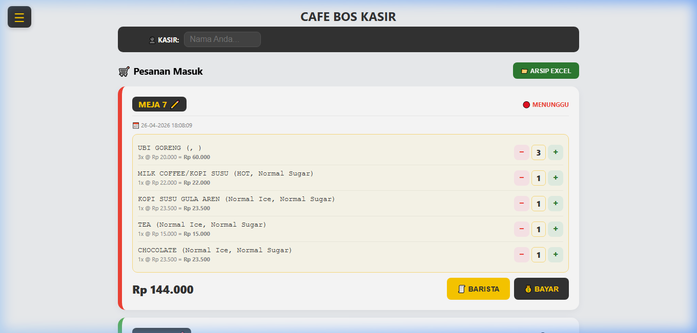
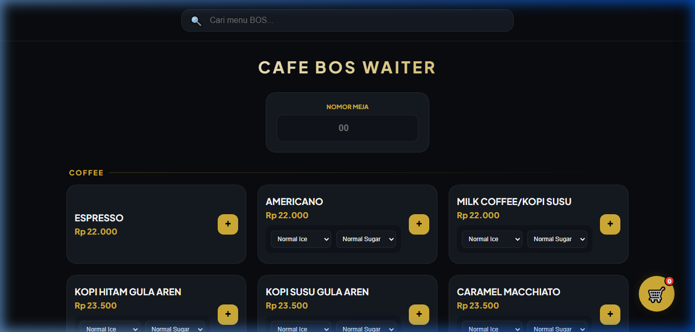
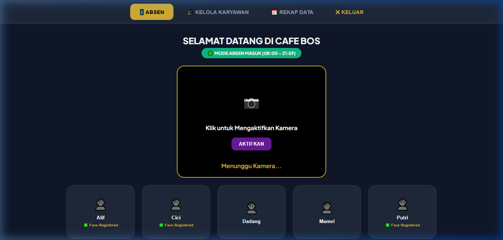
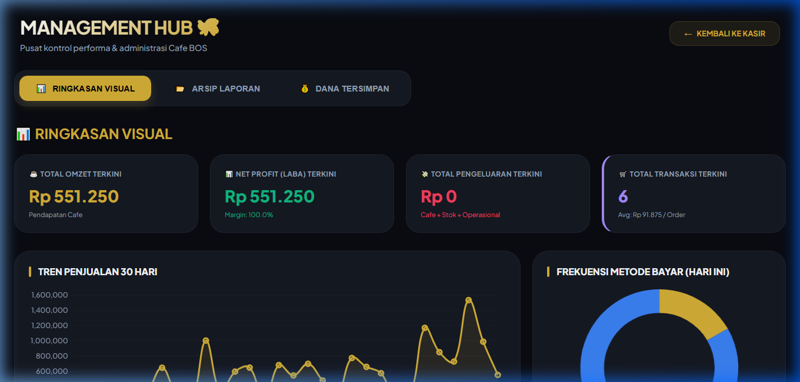

# ☕ Cafe BOS - Order & Management System

**Cafe BOS (Bikin Orang Sukses)** adalah sistem manajemen kafe terintegrasi yang dirancang khusus untuk efisiensi operasional, mulai dari pemesanan pelanggan hingga laporan keuangan otomatis dan absensi berbasis AI.



---

## 🌟 Fitur Utama

### 1. 📋 Sistem Pemesanan (Waiter & Customer)

- **Interface Responsif**: Desain modern yang optimal di HP pelanggan maupun tablet waiter.
- **Customization**: Pelanggan dapat memilih tingkat gula, es, dan topping secara mandiri.
- **Real-time Pending Orders**: Dashboard kasir akan otomatis terupdate setiap ada pesanan baru yang masuk.

### 2. 👤 Sistem Absensi Wajah (AI Face Recognition)

- **Face Recognition**: Menggunakan MediaPipe untuk autentikasi karyawan tanpa PIN.
- **Auto-Mirroring**: Pengalaman selfie yang natural saat proses absensi.
- **Smart Logic**: Sistem secara cerdas membedakan jam masuk (08:00 - 21:59) dan jam pulang (22:00 - 23:59).

### 3. 📊 Laporan & Analitik Bisnis

- **Automated Reports**: Generate laporan harian dalam format Excel dan PDF secara instan.
- **Analytics Dashboard**: Visualisasi data penjualan 30 hari terakhir dan menu terlaris.
- **Cloud Backup**: Seluruh laporan otomatis dicadangkan ke Google Drive setiap hari.

### 4. 📦 Manajemen Inventaris & Resep
- **Auto-Deduction**: Stok bahan baku otomatis berkurang setiap kali pesanan diselesaikan (berdasarkan rekap resep).
- **Stock Alert**: Pantau sisa bahan baku langsung dari dashboard inventory.

### 5. 🤖 AI Assistant (Gemini AI)
- Integrasi chatbot cerdas yang memahami seluruh menu dan informasi Cafe BOS untuk melayani tanya jawab pelanggan secara otomatis.

---

## 🛠️ Teknologi yang Digunakan

- **Backend**: Python (Flask Framework)
- **Server**: Waitress (High Performance Production Server)
- **Database**: SQLite
- **AI/ML**: MediaPipe (Face Mesh), Google Gemini AI API
- **Cloud**: Google Drive API, Cloudflare Tunnel (Akses Remote Aman)
- **Frontend**: HTML5, Vanilla CSS (Glassmorphism), JavaScript

---

## 🚀 Panduan Instalasi

### 1. Persyaratan Sistem
- Python 3.9+
- Koneksi internet (untuk AI & Cloud Backup)
- Sistem Operasi Windows (untuk fitur Thermal Printing)

### 2. Langkah Instalasi
1. **Clone Repositori**:
   ```bash
   git clone https://github.com/cotobakartech/cafe_bos.git
   cd cafe_bos
   ```
2. **Setup Environment**:
   ```bash
   python -m venv venv
   venv\Scripts\activate
   pip install -r requirements.txt
   ```
3. **Konfigurasi API**:
   - Masukkan `GEMINI_API_KEY` di `app.py`.
   - Letakkan `credentials.json` (Google Drive) di root folder.

---

## 🖥️ Cara Menjalankan

### Cara Cepat (Windows)
Cukup klik dua kali pada file **`jalankan_kasir.bat`**. Script ini akan otomatis menjalankan server, Cloudflare tunnel, dan Ngrok secara bersamaan.

### Cara Manual
```bash
python server.py
```

---

## 📂 Struktur Folder
- `app.py`: Backend logic & API Routes.
- `pdf_generator.py`: Modul pembuatan laporan PDF.
- `templates/`: UI Files (HTML).
- `static/`: Assets (CSS, JS, Images, Uploads).
- `docs/img/`: Dokumentasi visual sistem (Real Screenshots).

---

## 👤 Akun Admin Default
- **Username**: `@SuksesBOS`
- **Password**: `123456789`

---

© 2026 **PT Bikin Orang Sukses (BOS)**.
Developed & Supported by **Cotobakartech**.
All Rights Reserved.
